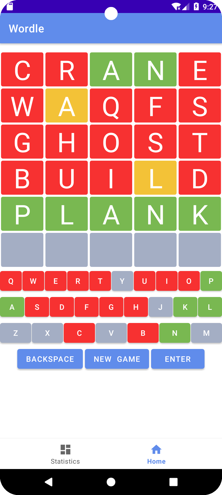
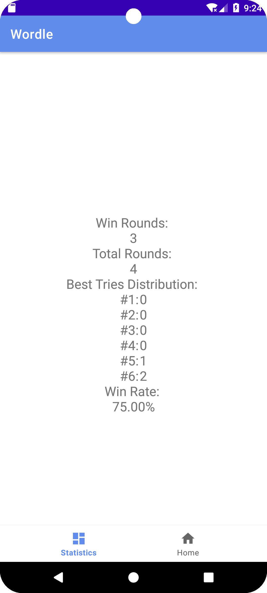
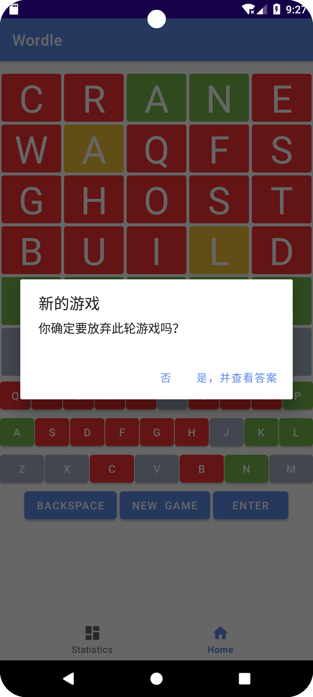

# sast2024-android

这是 [2024 年清华大学计算机系学生科协暑期培训](https://summer24.net9.org/) Android 部分的作业。

具体而言，你需要进行**代码填空**，使此仓库中的代码能够：

- 正常构建，
- 能在 Android 机器上运行，
- 且满足一定的功能要求。

你只需要补全仓库所有文件中 `TODO begin` 和 `TODO end` 之间的代码即可。

代码补充完后的一个参考版本请见 [leverimmy/Wordle-App](https://github.com/leverimmy/Wordle-App)，本仓库基于该仓库进行修改而得。

## 功能

- Wordle 的基本功能
  - 红色字母代表此字母不在目标单词中
  - 黄色字母代表此字母在目标单词中，但不在正确位置上
  - 绿色字母代表此字母在目标单词中，且在正确位置上
- 支持数据统计
  - 游戏获胜轮数
  - 游戏总轮数
  - 最佳猜测次数分布
  - 游戏获胜频率
- 支持放弃本轮
  - 即放弃本轮游戏，记为本轮游戏失败
  - 自动显示本轮游戏答案

## 示例图片

|                主页面                 |               数据统计页面               |      查看答案并开始新的游戏      |
| :-----------------------------------: | :--------------------------------------: | :------------------------------: |
|  |  |  |

## 代码结构

### Wordle 逻辑

Wordle 逻辑由 `com/example/wordle/utils/` 中的文件进行调度，它们是基于 [leverimmy/sast2024-java-answer](https://github.com/leverimmy/sast2024-java-answer) 二次开发而成的。核心函数为 `Wordle.guess` 函数，它接受一个 `State`，并返回此次猜测后的下一个 `State`。

### 用户存档

用户存档由 `com/example/wordle/data/User.java` 进行管理。`User` 类包含了游戏获胜轮数 `winRounds`、游戏总轮数 `totalRounds` 和最佳猜测次数分布 `guesses[]`。其中 `guesses[i]` 表示获胜的场次中，猜测 `i` 次即得最终答案的场次数量。

```java
package com.example.wordle.data;

public class User {

    public int winRounds;
    public int totalRounds;
    public int[] guesses;

    public User(int winRounds, int totalRounds, int[] guesses) {
        this.winRounds = winRounds;
        this.totalRounds = totalRounds;
        this.guesses = guesses;
    }

}
```

最终由 `MainActivity.java` 中的 `loadUser` 和 `saveUser` 两个函数，通过 SharedPreferences 进行存储与读取。

### 页面交互

页面交互由 `com/example/wordle/ui/` 中的文件进行调度。

- `dashboard/DashboardFragment.java` 展示数据统计页面。
- `home/HomeFragment.java` 展示游戏主页面。游戏主页面由一个 GridLayout 和一个 TableLayout 组成。
  - 上方的单词显示区域为 $6$ 行 $5$ 列的 GridLayout。
  - 下方的键盘区域为一个 TableLayout，每一行由一个 LinearLayout 组成。

在 `HomeFragment` 中，我使用了 `state` 管理当前局面，`guessWord` 这一 StringBuffer 管理**当前行的输入**。

- 当字母键或 Backspace 被按下时，更新 `guessWord` 并更新单词显示区域的字母。
- 当 Enter 键被按下时，将 `guessWord` 赋值于 `state.word` 并进行 `Wordle.guess` 操作。之后，更新当前局面，包括单词显示区域的字母颜色和下方键盘区域的字母颜色。
- 当 New Game 键被按下时，弹出窗口询问是否放弃此轮游戏，查看答案并开始新的一轮游戏。

## LICENSE

除非另有说明，本仓库的内容采用 [CC BY-NC-SA 4.0](https://creativecommons.org/licenses/by-nc-sa/4.0/) 许可协议。在遵守许可协议的前提下，您可以自由地分享、修改本文档的内容，但不得用于商业目的。

如果您认为文档的部分内容侵犯了您的合法权益，请联系项目维护者，我们会尽快删除相关内容。
